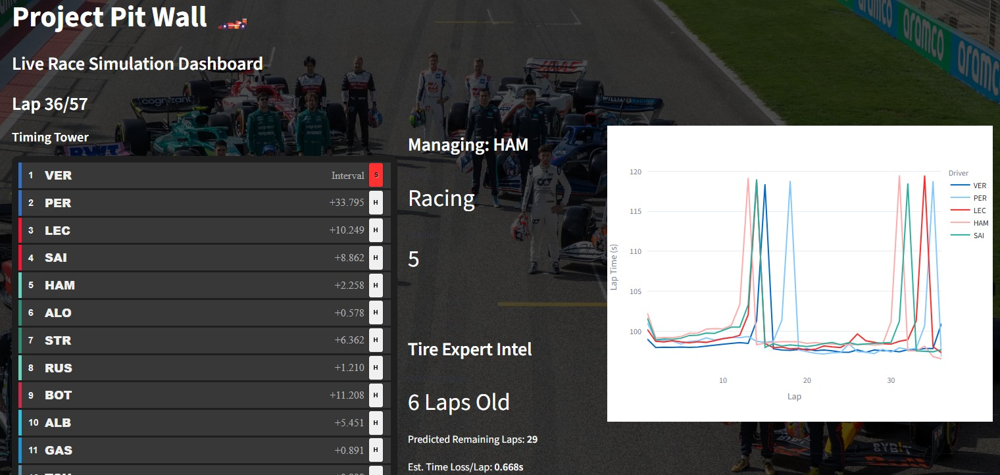
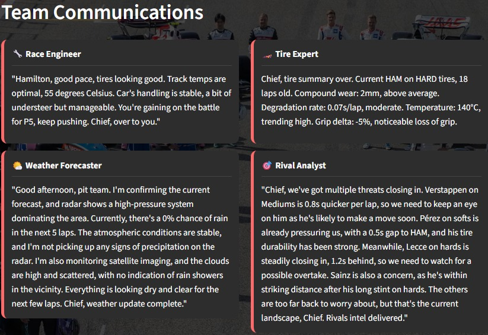
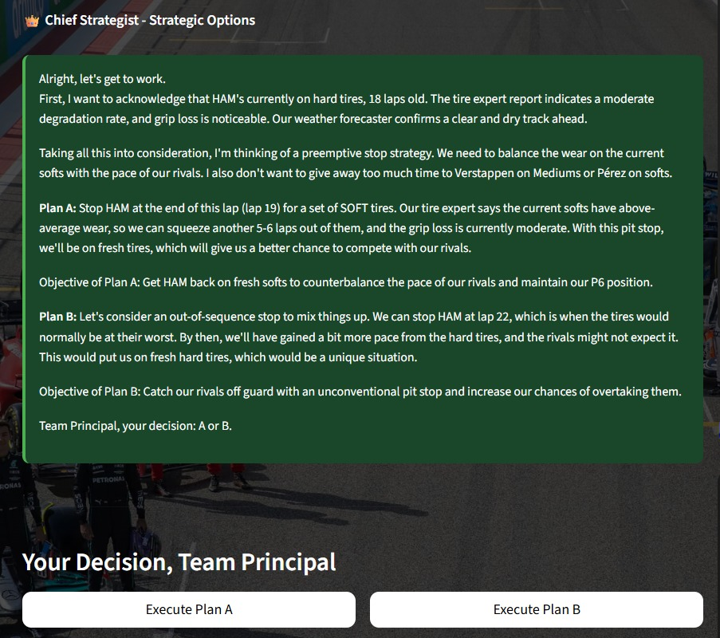
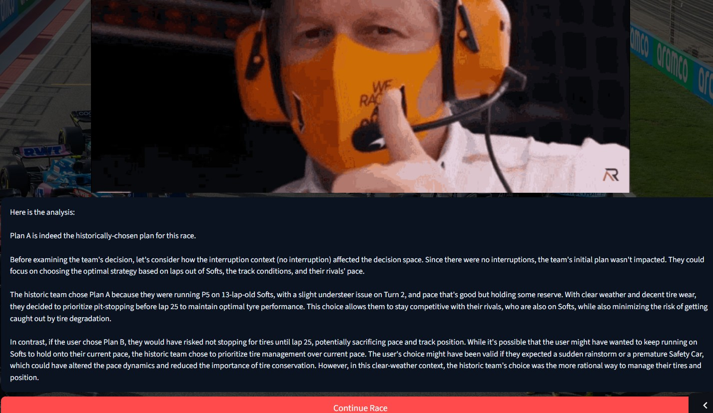
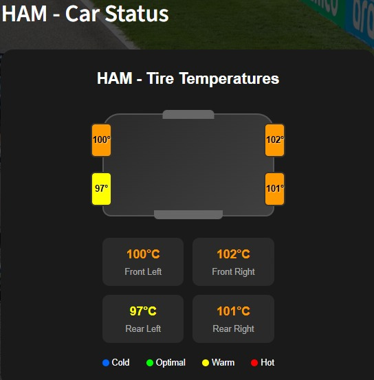
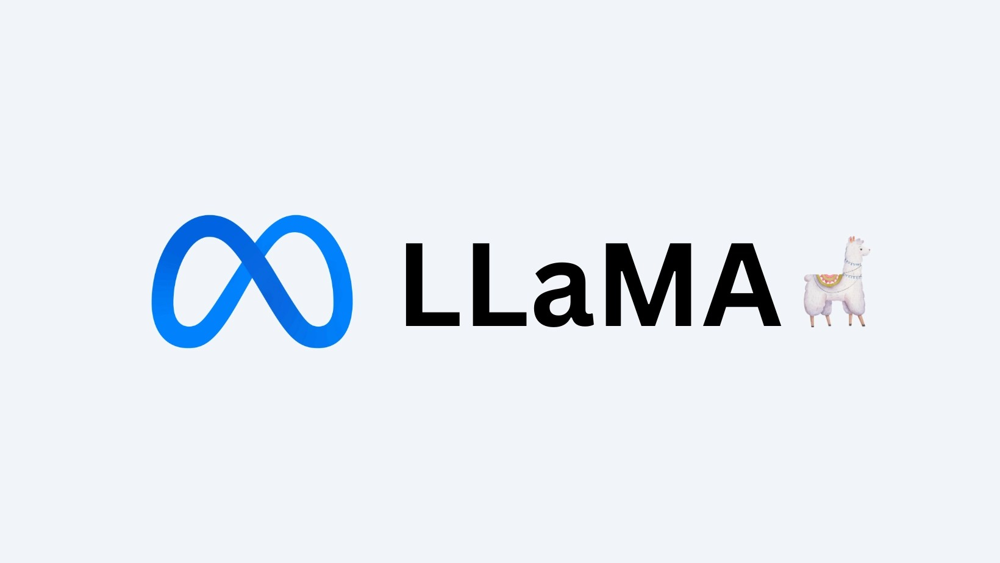

# Project Pit Wall — F1 Multi-Agent Strategy Simulator

Project Pit Wall is an immersive Formula 1 pit-wall experience that turns historical race telemetry into an interactive, educational simulator. It recreates the real-world flow of decisions on the pit wall and lets a human Team Principal step in, compare alternate strategies, and learn why pro teams chose what they did. The product brings real race context, domain-expert voices, and explainable AI into a single, polished demo — perfect for interviews, demos, and teaching strategy.

## What this project brings (the value)

Project Pit Wall transforms raw race data into an experience that teaches decision-making rather than just showing numbers. Instead of only displaying lap times and positions, the app assembles specialist perspectives — Race Engineer, Tire Expert, Weather Forecaster, Rival Analyst and Chief Strategist — then presents two competing plans: One of them is the historical choice taken in the race, and the other is an alternative. When you pick a plan the Decision Analyst (LLM) explains, in plain language, why the historical team chose what they did or why your alternative might be risky. This makes the project ideal for motorsport fans who want to learn strategy, interviewers who want to assess your product thinking, and hiring managers who want to see domain + ML applied thoughtfully.

## Key features, shown visually

The Main Dashboard presents a timing tower, lap-time trends, and the selected driver’s car and tyre status. This view helps you absorb the overall race picture at a glance and see where strategic pressure is building.

When a strategy trigger occurs — such as a Safety Car, Virtual Safety Car, or a spike in tyre degradation — the Strategy Overlay opens. Four specialist agents present concise, role-specific briefs and the Chief Strategist synthesizes two clear plans. The overlay is the moment of truth: read the experts, pick a plan, and learn.

If you make a correct decision (the historically executed plan), the Decision Analyst presents a single, cohesive explanation in a polished card with a typewriter reveal and an image/GIF that contextualizes the outcome. The explanation prioritizes any interruption (for example Safety Car or rain) and explains how it reshaped options. If you make an incorrect decision, the Decision Analyst explains why that move was not taken in the real race, lays out the concrete risks, and when the alternative might have been viable. The explanation is accessible, instructional, and tied directly to the agents’ evidence.

All agent discussions are recorded and surfaced so you can inspect the exact messages that influenced the strategist. If an interruption (Safety Car / VSC / rain) was active at the decision point, that context is highlighted and included explicitly in the briefing so the LLM can reason with it.
The car tyre display shows per-corner tyre temperatures and a schematic that helps you interpret wear patterns visually. Telemetry gaps are handled elegantly by simulated fallbacks so the experience remains instructive even when historic telemetry is limited.

## Why multi-agent

Modeling the pit wall as multiple specialist agents yields briefings that feel authentic and trustworthy. Each agent focuses on what real human specialists would provide: the Race Engineer gives crisp radio-style updates, the Tire Expert quantifies wear and windows, the Weather Forecaster times rain risk, and the Rival Analyst flags threats. The Chief Strategist doesn’t guess everything alone — it synthesizes these focused inputs into actionable plans. This division of responsibility makes the explanations richer and easier to verify, which is critical when teaching strategy to newcomers or demonstrating product maturity to recruiters.

## Language model and media

The project uses a Llama-family LLM for the agents and the Decision Analyst. The LLM is prompted to prioritize interruption context (Safety Car / Rain) when present, and to produce short, educational paragraphs rather than opaque technical prose. Use the included placeholder image to show the Llama model branding.

## Data Collection Credits

This project uses the FastF1 library to load and parse historical Formula 1 session and lap telemetry that powers the simulation. FastF1 provides the race session objects, lap timing, and telemetry streams that make the pit-wall scenarios realistic. Add the official FastF1 link here: [FastF1](https://github.com/theOehrly/Fast-F1).

## Who benefits

Product managers, hiring managers, and recruiters get an immediate sense of applied ML + product thinking: domain fidelity, agent design, and explainability. Motorsport coaches and fans gain a hands-on teaching tool that makes abstract strategic trade-offs tangible. Learners get a safe playground to experiment: try bold alternatives, see why they fail in context, and internalize cornerstones of F1 strategy.

## Short concluding pitch

Project Pit Wall is more than a visualization. It is a learning product that converts data into expertise by combining specialized agent voices with an explainable LLM teacher. It communicates not only what happened in a race, but why it happened — and it does so in a way that is believable, inspectable, and immediately useful for someone trying to learn or demonstrate strategic thinking.
